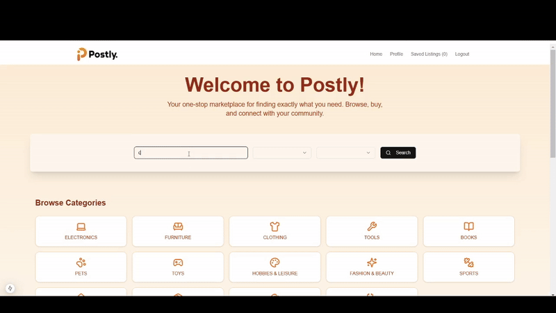

# Postly

Postly is a marketplace application that allows users to browse and upload listings, create user accounts, filter listings by category and location, perform full-text searches, log in and log out, and save or unsave listings.

## Features

- **Browse Listings**: View all available listings.
- **Upload Listings**: Create new listings with images, descriptions, and prices.
- **User Accounts**: Register and manage user accounts.
- **Category and Location Filtering**: Filter listings by category and location.
- **Full-Text Search**: Search for listings using keywords.
- **Login/Logout**: Secure authentication using JWT.
- **Save/Unsave Listings**: Save favorite listings for later viewing.

## Demo

### Browsing Listings


### Signing up for an Account


### Creating a Listing

.gif>)

### Saving Listings



## Tech Stack

- **Next.js**: React framework for building server-side rendered applications.
- **AWS S3**: Storage service for listing images.
- **Prisma ORM**: Database ORM for PostgreSQL.
- **PostgreSQL**: Relational database for storing application data.
- **Shadcn Component Library**: UI components for building the user interface.
- **JWT**: JSON Web Tokens for secure authentication.

## Getting Started

### Prerequisites

- Node.js (v16 or higher)
- PostgreSQL database
- AWS S3 bucket for storing images

### Installation

1. Clone the repository:

   ```sh
   git clone https://github.com/yourusername/postly.git
   cd postly
   ```

2. Install dependencies:

   ```sh
   npm install
   ```

3. Set up environment variables:

   Create a `.env` file in the root directory and add the following variables:

   ```properties
   DATABASE_URL="your_postgresql_database_url"
   PULSE_API_KEY="your_pulse_api_key"
   SESSION_SECRET="your_session_secret"
   AWS_S3_ACCESS_KEY_ID="your_aws_s3_access_key_id"
   AWS_S3_SECRET_ACCESS_KEY="your_aws_s3_secret_access_key"
   AWS_REGION="your_aws_region"
   AWS_S3_POSTLY_LISTINGS_BUCKET="your_aws_s3_bucket_name"
   ```

4. Generate Prisma client:

   ```sh
   npx prisma generate
   ```

5. Run database migrations:

   ```sh
   npx prisma migrate dev
   ```

6. Seed the database (optional):

   ```sh
   npm run seed
   ```

### Running the Application

1. Start the development server:

   ```sh
   npm run dev
   ```

2. Open your browser and navigate to `http://localhost:3000`.
